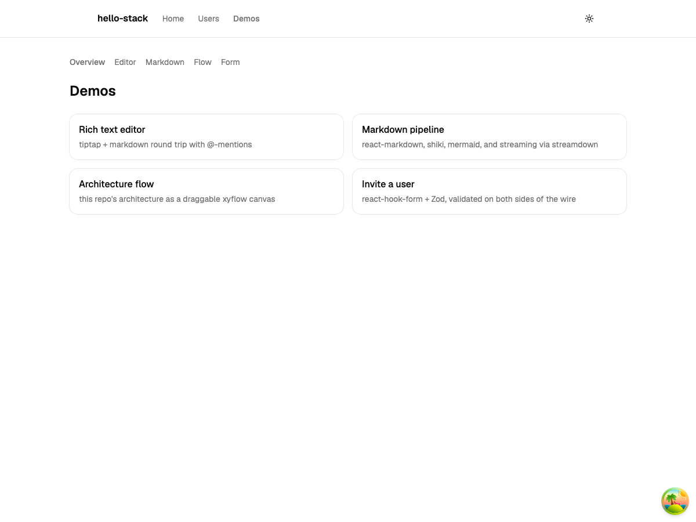
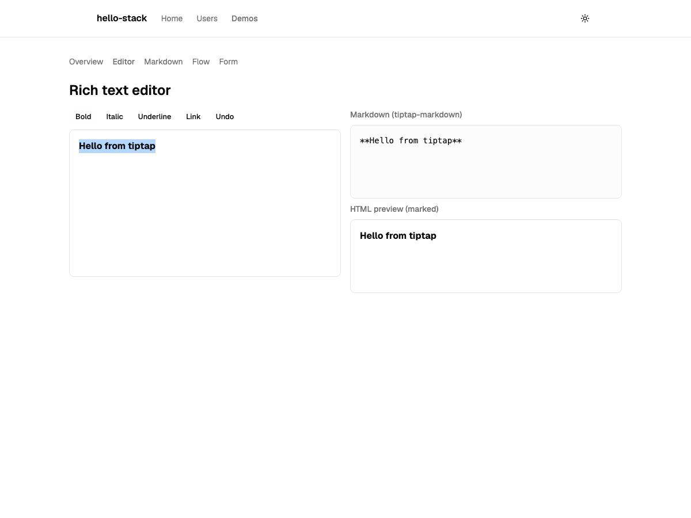
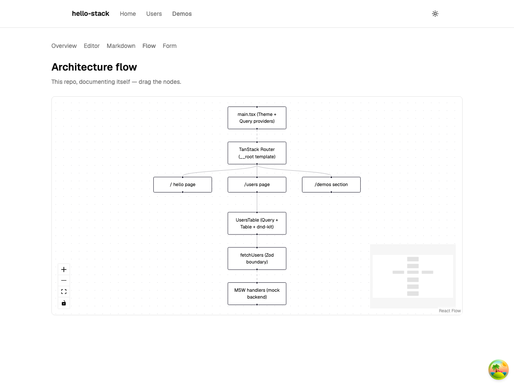
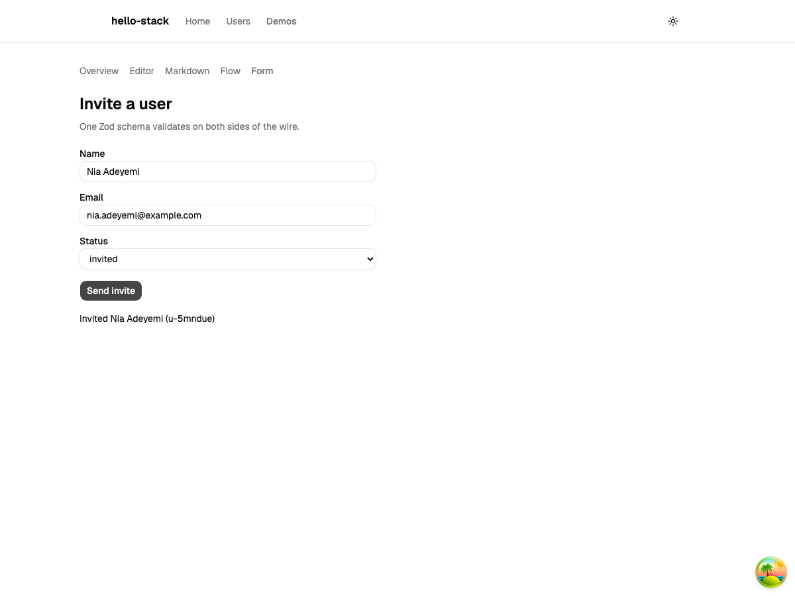

# Screenshots

Captured from the running app (Vite dev server + MSW mock backend), light theme.

## Users table

The sortable users table: MSW-fed rows, dnd-kit drag handles, `StatusBadge` variants.

## Demos

The `/demos` section — every staged library exercised by a composed page.

### Overview

Motion-animated index cards; the palm-tree button (bottom right) is the dev-only TanStack Query devtools toggle.

### Rich text editor

tiptap → tiptap-markdown → `marked` round trip: bolded editor text, its markdown serialization, and the HTML preview.

### Markdown pipeline

react-resizable-panels split: editable source beside the rendered output — GFM table, task list, shiki-highlighted TypeScript, and a mermaid flowchart. "Stream it" replays the document through streamdown from `GET /api/stream`.

### Architecture flow

The repo's own architecture as a draggable xyflow canvas.

### Invite a user

react-hook-form + Zod with a completed submission — the confirmation id was assigned by the MSW handler after re-validating with the same `InviteUserSchema` the client used.

